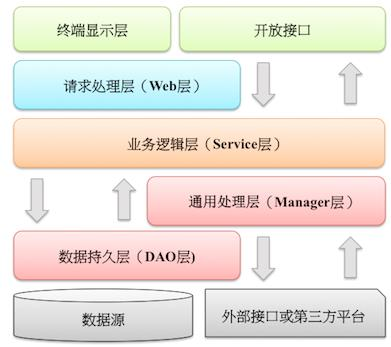

# JAVA编码规范

> An awesome project.

### 1 工程
#### 1.1 工程分类
Java编写的应用按照逻辑触发方式主要可以划分为：Web(站点)、Service(服务)、Job(作业)。

|  工程   | 触发者 |上游应用 |网络 |通信协议 |
|  ----  | ----  |----   |----  |----  |
| **Web**    | 人    |浏览器  |单元格 |单元格 |
| Service| 单元格 |前置Web或者其他Service |单元格 |单元格 |
| Job    | 单元格 |无 |单元格 |单元格 |

   三种工程类型的项目构建原则也不尽相同。
   Web对接的是终端用户，往往根据用户类型来划分Web。例如财务管理系统、投顾作业平台，都是根据用户的身份类型来划分系统。
Service和Job基本都是根据自身业务的高内聚低耦合原则来划分。例如身份认证服务、对账作业。至于服务的粒度由开发者自身把控，部分小Job可以合并到Web或者Service中不需要单独创建工程了。

 

